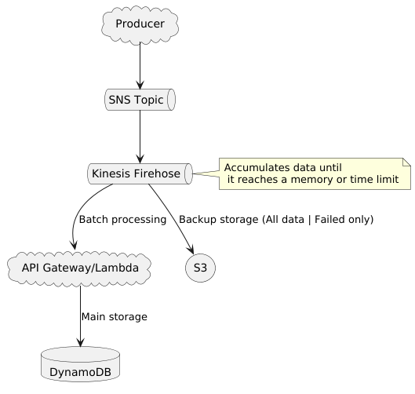

# Shopping Cart Microservice

Your task is to develop the backend for a shopping cart microservice. This service is crucial for
managing the process during and after a purchase, ensuring that all data is securely stored in a
NoSQL database. The flow begins with an API call, which should be handled through a resilient
mechanism, leading to successful data persistence. Since this flow is critical, any data loss
directly translates to lost revenue.
The suggested payload for the message includes the following fields:

- buyer_id: int
- product_id: int
- number_of_installments: int
- total_amount: double
- purchase_date: date

# Architectural proposal

# Deploy

1. Install Python 3.12: `sudo apt-get install python3.12`
2. Install poetry: `pip install poetry`
3. Run poetry on root project: `poetry install`
4. Create package for aws lambda: `make zip_lambda`
5. Install [Terraform](https://developer.hashicorp.com/terraform/tutorials/aws-get-started/install-cli)
6. On [vars.tf](./infra/vars.tf) put a value for "project" variable.
7. Inside infra folder, run terraform commands:
   - `terraform init`
   - `terraform apply`

# Publishing

Run [producer.py](./producer.py). This script with generate fake data.

# Consuming

You can see the messages on dynamodb using web console.

## Improvement points

- Observability
- CI/CD
- Sonar